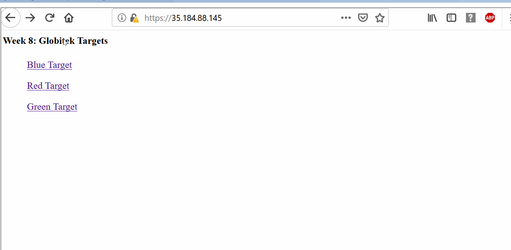
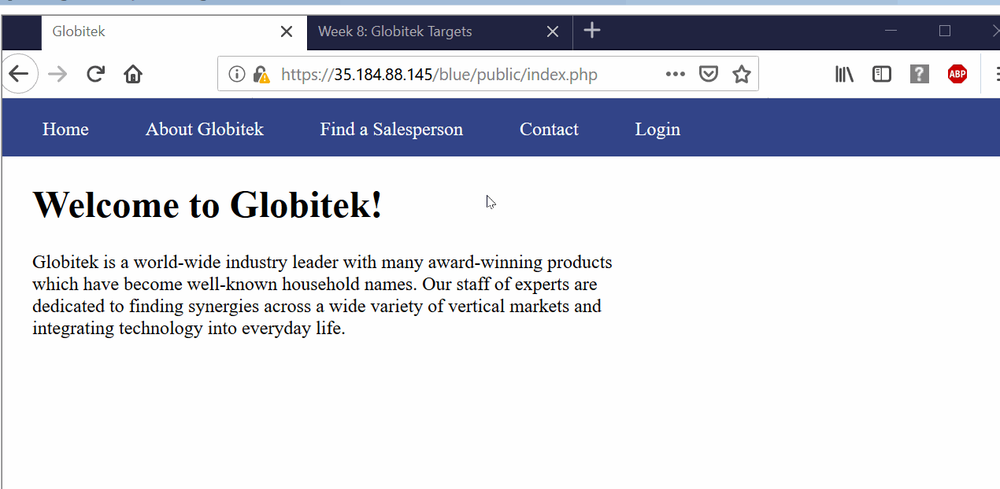

# Web-Security-Week8

# Project 8 - Pentesting Live Targets

Time spent: **9** hours spent in total

> Objective: Identify vulnerabilities in three different versions of the Globitek website: blue, green, and red.

The six possible exploits are:
* Username Enumeration
* Insecure Direct Object Reference (IDOR)
* SQL Injection (SQLi)
* Cross-Site Scripting (XSS)
* Cross-Site Request Forgery (CSRF)
* Session Hijacking/Fixation

Each version of the site has been given two of the six vulnerabilities. (In other words, all six of the exploits should be assignable to one of the sites.)

## Blue

Vulnerability #1: SQL Injection (SQLi)
  * GIF Walkthrough:
    
  * Description: Using SQL injection to the id attribute of each section (Blue, Green and Red), we can see from above that trying to use ``` ' OR 1=1'-- ``` in the Blue section we receive the message "Database query failed." Additionally, for the Red and Green sections the SQL injection statement redirected the screen and it cannot do any change to them.

Vulnerability #2: Session Hijacking/Fixation 
  * GIF Walkthrough:
    
  * Description: Login in to the Blue section, and once logged in change the url from ```public/... ``` and onwards to ``` public/hacktools/change_session_id.php ```. Also, from this the session ID is retreived. Essentially, I can log in in one browser and get the session ID which can be used by a past login process in another browser. This hacking method demonstrates that the session can be hijacked and user informations can be stolen. 


## Green

Vulnerability #1: __________________

Vulnerability #2: __________________


## Red

Vulnerability #1: __________________

Vulnerability #2: __________________


## Notes

Describe any challenges encountered while doing the work
